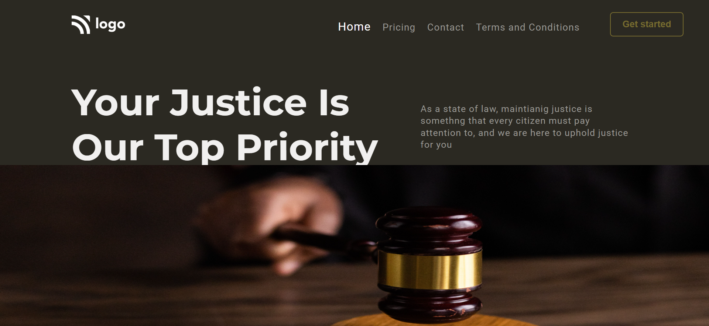

# Project 3 - HTML and CSS

By Piyush

Deployed link of website &nbsp; 

 

# [Link to Project 3](https://law-homepage1.netlify.app/) 

 

# Preview of the Project.

 

## What I learnt from this Project?

 

- I learnt how to **change shape and size** of the image
- I also learn how to make **navbar clickable.**
- I also learn about creating decent **clickable buttons**.

 

# Time Taken to complete this project is about 45 minutes.